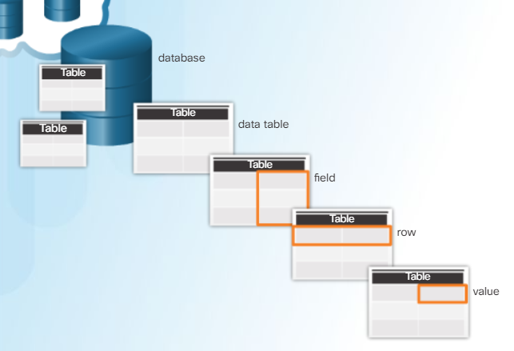

# Structured Query Langauge

The __Structured Query Language (SQL)__ is a standard that defines that language that communicates with your database. Think of SQL as two things:
- A set of guidelines and rules
- The programming language itself that talks to the databases

You will hear these terms interchanged, so it's best to become familiar.

There are many different forms of SQL that are taylored to specific __Database Management Systems (DBMS)__, and there are [a lot of DBMS](https://www.sqlsplus.com/the-most-popular-database-management-systems-dbms-in-the-world-in-2020/) out there, and each DBMS comes with it's own version of SQL.

In this workshop, we are focused on the [__MySQL__](https://www.mysql.com/) DBMS and the MySQL version of SQL. We will also be using a third-party application known as  [phpMyAdmin](https://www.elegantthemes.com/blog/resources/a-quick-guide-to-phpmyadmin-and-how-you-can-use-it#:~:text=phpMyAdmin%20is%20an%20open-source%20tool%20built%20on%20PHP,to%20manage%20as%20many%20databases%20as%20you%20want.) to assist us in managing the MySQL DBMS through our local computer network and web browser.

The SQL language helps us accomplish to main things:
- Define the data model of our relational databases
- Load and extract data from our databases

Of course, this is large simplification and SQL can take years to master. We will only go over the basics in this training.


### Extracting Data

Before we talk about data models and loading data, it's usually easier to focus on extracting data from an already established database. This is know as __querying__. This is guide will breakdown the query commands and syntax of SQL.

First and foremost, `SELECT`, `FROM`, and `WHERE` are the three primary statements of all SQL queries. 
<br/>
`SELECT` is asking for the specific _attributes_ (or columns / fields) we are referencing. 
<br/>
`FROM` is asking for the specific _relations_ (or tables) we are referencing. 
<br/>
`WHERE` is asking for the specific _tuples_ (or rows) we are referencing.
<br/>
A good way to think about this is:
- First we pin-point the relations we want to get data from
- Then we specific the attributes we are interested in
- Lastly, we identify the specific tuples that hold our data by filtering on specific records (or values)


<br/>
<br/>
Here is the overall structure of that query:

```
SELECT [attributes]
FROM [relations]
WHERE [tuples]
[additonal_arguments]
```

The additonal arguments assist us with refining our queries. Here are some of the more common arguments:
- `AND` or `OR` - The logical operator "and" and "or"
- `>`, `<`, `>=`, `<=`, `<>` - The logical operators that add order to our elements, such as "greater than"
- `IS` - The logical operator that verifies equivalence
- `IS NOT` - The logical operator that verifies no equivalnece
- `NULL` - References an empty or blank value
- `ORDER BY` -Orders the data specified by:
    - `DESC` or `ASC` - DESC is for descending, ASC is for ascending
- `LIKE` - The logical operator that compares to a string of text
    - `%` - Wildcard operator that is an abstract placeholder for characters
    -   Learn more about it here at https://www.w3schools.com/SQL/sql_like.asp
- `LIMIT` - Statement that restricts the amount of tuples returned; great for working with large data
